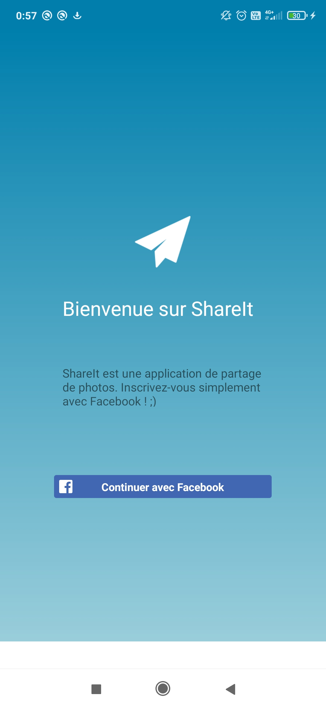
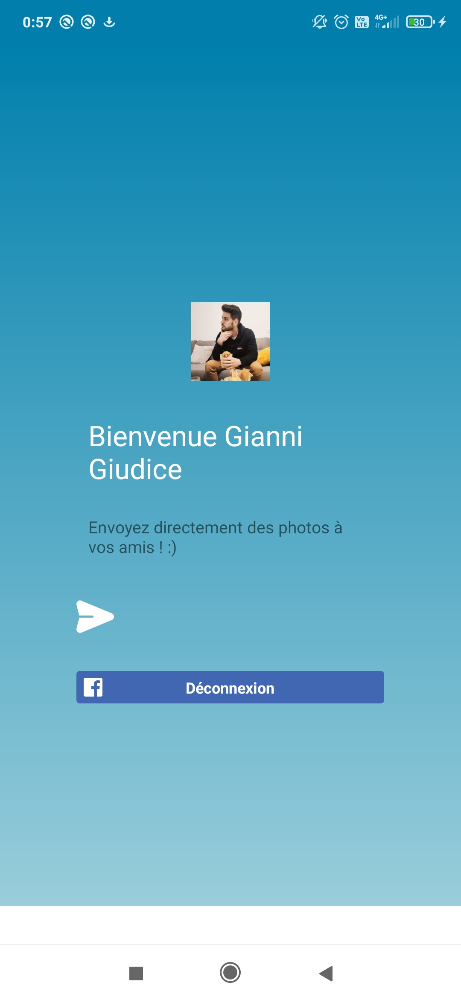
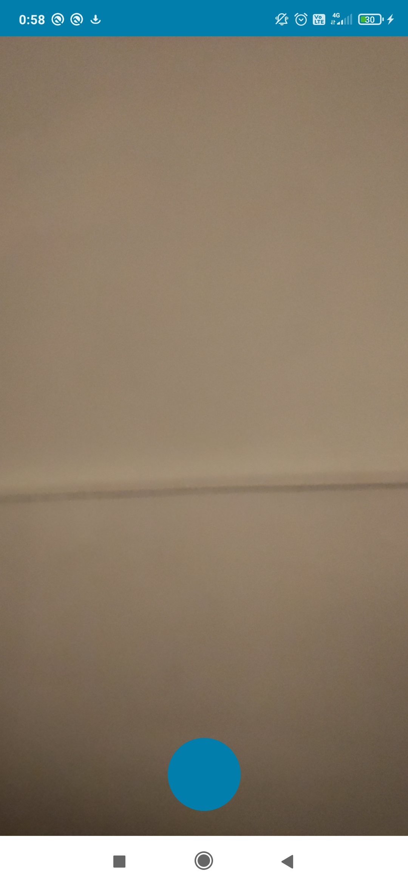
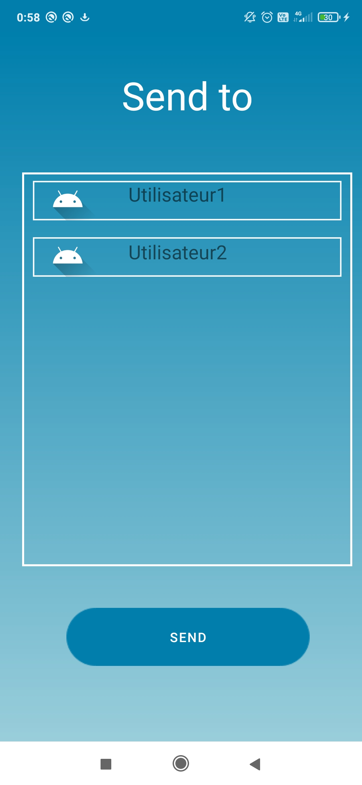

# ShareIt

## Introduction

ShareIt est une application mobile dite "**Snapchat like**" faite sous **Android Studio** et développée en **Kotlin**.

## Fonctionnalités

- Connexion

ShareIt permet à l'utilisateur de se connecter via **Facebook**. Nous avons ainsi configuré une application via Facebook for Developer afin de rendre 
l'accès à l'application plus agréable pour l'utilisateur.

- Prise de photo

ShareIt permet à l'utilisateur de prendre une photo. Celle-ci s'enregistre alors sur son appareil.

- Envoi d'une photo

ShareIt permet à l'utilisateur d'envoyer une photo à un autre utilisateur après l'avoir prise depuis l'application.

## Captures

  
  
  
  

